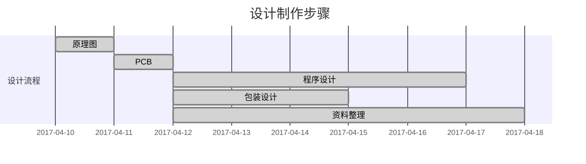

@[TOC](目录：)
注：==本文仅用于学习分享==，分享自己DIY制作的多模式51单片机心形流水灯[纯手工制作]，若有不妥之处，请指正，感谢]


<font color=red size=5 face="微软雅黑">本帖相关 【代码与原理图PCB 】下载链接↓↓↓：</font>
链接：https://pan.baidu.com/s/1X5z-m_Zj6Xq4NnS9ReeVmA 
提取码：e0cz 

<kbd>**用到的工具有**：</kbd>
 - [x]  Keil 4编译器环境
 - [x] altium designer 原理图
 - [x] altium designer PCB

==实现的小功能有：==
==①	按下蓝色电源键
{按下后有蓝色电源指示灯被点亮}
②	按键一 为音乐键[蜂鸣器发出青花瓷的简单音乐]
③	按键二 为呼吸灯[心形灯渐亮渐灭]   ---PWM调制
④	按键三 为流水灯[十几张花样流水灯方式]==

*每次切换模式请先按下 按键四 复位键进行复位。==[需改进的地方]==
*充电口为盒子左侧下方{普通安卓MINI-USB都可进行充电}


# 总体设计
1.基础硬件DIY设计
2.单片机程序设计
3.效果展示

## 1.基础硬件DIY设计
**电路硬件：**
[MCU]STC89C52RC
[外设]蜂鸣器/24个LED/4个四角按键

###  1）整体原理图


### 2）PCB电路


### 3）3D_PCB
- TOP层


## 2.单片机程序设计
###  1）呼吸灯[简易模拟PWM]
```javascript
//呼吸灯  [PWM调制]
	while(1)
	{		
		for(high=1;high<cycle;high++)
		{
			P2=P1=P0=0XFF;
			delay2(high);
			P2=P1=P0=0X00;
			low=cycle-high;
			delay2(low);
		}			
		for(low=1;low<cycle;low++)
		{
			
			P2=P1=P0=0XFF;;
			high=cycle-low;
			delay2(high);
			P2=P1=P0=0X00;
			delay2(low);
		}
	}

```


###  2）蜂鸣器音乐
// 定义青花瓷简易音谱  [定时器产生音乐脉冲]
```javascript
// 定义青花瓷简易音谱  [定时器产生音乐脉冲]
uchar code music[][2]={{0,4},
{0,4},{24,4},{24,4},{21,4},{19,4},{21,4},{14,8},{19,4},{21,4},{24,4},{21,4},{19,16},{0,4},{24,4},{24,4},{21,4},{19,4},{21,4},{12,8},{19,4},{21,4},{24,4},{19,4},{17,16},{0,4},{17,4},{19,4},{21,4},
{24,4},{26,4},{24,4},{22,4},{24,4},{21,4},{21,4},{19,4},{19,16},{0,4},
{17,4},{19,4},{17,4},{17,4},{19,4},{17,4},{19,4},{19,4},{21,8},{24,4},{21,4},{21,12},{0,4},{24,4},{24,4},{21,4},{19,4},{21,4},{14,8},{19,4},{21,4},{24,4},{21,4},{19,16},{0,4},{24,4},{24,4},{21,4},
{19,4},{21,4},{12,8},{19,4},{21,4},{24,4},{19,4},{17,16},{0,4},{17,4},{19,4},{21,4},{24,4},{26,4},{24,4},{22,4},{24,4},{21,4},{21,4},{19,4},{19,12},{12,4},{21,8},{19,4},{19,8},{17,16},
{0xFF,0xFF}};

```
```javascript
// 蜂鸣器音乐  [定时器产生音乐脉冲]
	while(1)
	{
		m=music[i][0];n=music[i][1]; 
		if(m==0x00)
		{TR0=0;delay1(n);i++;} 
		else if(m==0xFF)
		{TR0=0;delay1(30);i=0;} 
		else if(m==music[i+1][0]) 
		{TR0=1;delay1(n);TR0=0;pause();i++;}
		else
		{TR0=1;delay1(n);i++;}
		}
	}
```
###  3）几种简易流水灯方式
```javascript
// 蜂鸣器音乐  [定时器产生音乐脉冲]
void disp10()			//状态10 从LED全部亮到全不亮(间断8格的3个LED开始逆时针熄灭)
{
	for(i=0;i<9;i++)
	{
		P0=table5[i];
		P2=table4[i];
		P1=table4[i];
		delay(100);
	}
	delay(300);
}

void disp11()			//状态11 间断8格的3个LED亮并顺时针旋转
{
	for(j=0;j<2;j++)
	{
		for(i=0;i<8;i++)
		{
			P0=table0[i];
			P2=table1[i];
			P1=table1[i];
			delay(100);
		}
		P0=0xff; P2=0xff; P1=0xff;
		for(i=0;i<8;i++)
		{
			P0=table0[i];
			P2=table1[i];
			P1=table1[i];
			delay(100);
		}
		P0=0xff; P2=0xff; P1=0xff; 
	}
}

void disp12()			//间断8格的3个LED亮，然后顺时针逐渐点亮(直到全部点亮)
{
	for(i=0;i<8;i++)
	{
		P0=table2[i];
		P2=table3[i];
		P1=table3[i];
		delay(100);
	}
	delay(1000);
}

void disp13()			//状态13 从LED全部亮到全不亮(间断8格的3个LED开始顺时针熄灭)
{
	for(i=0;i<8;i++)
	{
		P0=table4[i];
		P2=table5[i];
		P1=table5[i];
		delay(100);
	}
	delay(300);
}

void disp14()			//状态14 从LED不亮到全亮(从P0.0、P1.0、P1.7、P2.0开始逐步点亮)
{
	for(i=0;i<8;i++)
	{
		P0=table2[i];
		P2=table2[i];
		if(i<4)
		{
			P1=table8[i];
		}		
		delay(100);
	}
}

void disp15()			//状态15 从LED全亮到全不亮(从P0.7、P1.3、P1.4、P2.7开始逐步熄灭)
{
	for(i=0;i<8;i++)
	{
		P0=table5[i];
		P2=table5[i];
		if(i<4)
		{
			P1=table11[i];
		}		
		delay(100);
	}
}
```
## 3.效果展示        
        DESIGN


### 1）实物电路顶层图


### 2）实物电路底层图


内部较为简陋  (*￣︶￣)

###  3）整体效果图

<kbd>**可充电设计**</kbd>

内置锂电池连接锂电池充电模块【可用mini-USB充电口充电】

<kbd>**可玩性**</kbd>

预留三个调试按键，一个复位按键
程序可改进:按下功能键直接切换模式，不必按下复位才行。


>Dwfish 淹死的鱼      	2018.11.27

<div align=center>

