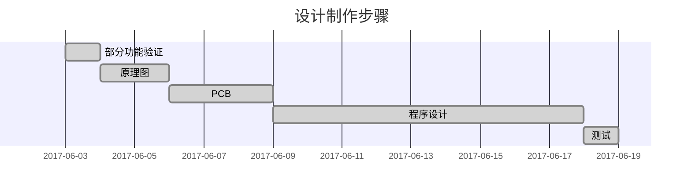

@[TOC](目录：)

注：分享自己在使用C8051F020单片机中的所做的一个小方案【DIY】。

<kbd>**方案一 用到的主要工具材料**：</kbd>
 - [x]  Keil 4
 - [x]  C8051F020 微控制器
 - [x] 主要功能芯片：PCF8563 
 
 
# （一）方案一：总体性设计
==方案简易示意图：==


## 1.基础电路设计【硬件】
**电路硬件：**
**[MCU]** C8051F020
**[稳压电源]**【LM2596-5.0V】12.0V稳压5.0V      【TPS7333】5.0V稳压3.3V 
**[外围电路]** 1.7寸12864液晶屏、串口屏、功能按键、PCF8563实时时钟电路

###  1）整体原理图


### 2）PCB电路

### 3）3D_PCB
- TOP层


- BOTTOM层


##  2.程序设计【软件】
###  1）主程序设计
```c
#include "c8051f020.h"
#include "delay.h"
#include "lcd.h"
#include "I2C.h"
#include "keydown.h"

typedef unsigned int u16;
typedef unsigned char u8;
int Clock[16]; //读寄存器pecf8563  buffer

sbit LED = P1^6;//下载程序指示灯

extern u8 KeyValue;
extern u8 code num[],kong[],kong1[],rain[];
extern int flag_move,flag_set,Time_Count_flag;

struct Time //结构体全局变量
{
	unsigned char second;
	unsigned char minite;
	unsigned char hour;
	unsigned char day;
	unsigned char week;
	unsigned char month;
	unsigned char year;
};
struct Reg
{
	unsigned char reg1;
	unsigned char reg2;
	unsigned char clk;
	unsigned char count1;
	unsigned char count2;
};
struct Alarm
{
	unsigned char minite;
	unsigned char hour;
	unsigned char day;
	unsigned char week;
};
/*----------------函数定义声明-------------------------*/
void PORT_Init();//交叉开关使能
void SYSCLK_Init();
void Disable_Wdog();  //禁止看门狗定时器
void Clock_Setting();
void Init();             //初始化
	

void PORT_Init()//交叉开关使能
{
	XBR0    = 0x07;   // Enable UART0(TXD0-P0.0  RXD-P0.1)  SPI_SCK-P0.2  SPI_MISO-P0.3
										// SPI_MOSI-P0.4  SPI_NSS-P0.5   (SDA-P0.6   SCL-P0.7)
  XBR1    = 0x10;		// INT1使能P1.2
  XBR2    = 0x44;		// TXD1-P1.0  RXD1-P1.1
	P3MDOUT = 0xff;	
	P1MDOUT = 0xff;	
	P2MDOUT = 0xff;	
}
/*void Timer0_Init() 
	{     
		TMOD      = 0x02; //方式2 定时，自动重装载  
		TL0       = 0x06;     
		TH0       = 0x06; 
	}*/
void SYSCLK_Init()
{   
	unsigned int i;
	OSCXCN=0X67;           //0X67=0110,0111
	for(i=0;i<256;i++);    //等待>1ms
	while(!(OSCXCN&0X80)); //等待XTLVLD变为1
	OSCICN=0X88;           //时钟失效监测器，选择外部时钟源作为系统时钟
}

void Disable_Wdog()   //禁止看门狗定时器
{  
	WDTCN=0xDE;  
	WDTCN=0xAD; 
}

void Clock_Setting()
{
	struct Time TIME={0x10,0x49,0x09,0x15,0x00,0x03,0x18};//设置时间： 秒/分/时/日/星期/月/年
	struct Reg REG={0x00,0x00,0x83,0x82,0x00};//设置寄存器
	struct Alarm ALARM={0x00,0x00,0x00,0x00};//设置报时控制寄存器
	unsigned char Set[16];//写寄存器buffer
	Set[0]=REG.reg1;	
	Set[1]=REG.reg2;
	Set[2]=TIME.second;
	Set[3]=TIME.minite;
	Set[4]=TIME.hour;
	Set[5]=TIME.day;
	Set[6]=TIME.week;
	Set[7]=TIME.month;
	Set[8]=TIME.year;
	Set[9]=ALARM.minite;
	Set[10]=ALARM.hour;
	Set[11]=ALARM.day;
	Set[12]=ALARM.week;
	Set[13]=REG.clk;		//CLKOUT输出寄存器	 0DH
	Set[14]=REG.count1;	//定时器控制寄存器	 0EH
	Set[15]=REG.count2; //定时器倒计数寄存器 0FH
	//WritePcf(Set,0,16);//设置时钟
}

void Init()
{
	Disable_Wdog();
	PORT_Init();
	SYSCLK_Init();
  Initial_Lcd();//LCD初始化
	clear_screen();//清屏
	SMBusInit();//SMBus初始化 设置I2C
}
void main()
{	
	u8 i=0;
	LED=0;//下载程序成功指示灯
	Init();
	EA=1;//打开中断
	Clock_Setting();
	//Timer0_Init();//定时器0中断
	//IE = 0x82;//中断初始化
	//TR0=1;
	Delay_ms(200);
	while(1)
	{
		//Clock_Setting();//需设置时间时使用
		ReadPcf(Clock,0,16);//实时时钟显读取
		//display_graphic_8x16(1,(0+8*0),&num[KeyValue*16]);//按键值标志
		Key_setting();
		Time_Watch();
	}
}

```


###  2）I2C读写PCF8563

```c
unsigned char Command;//命令缓存
int *I2CDataBuff;//待法发数据、接收数据指针
unsigned char ByteNumber;  //发送字节数
unsigned char ByteReadBytes;//读字节数
int *ByteReadAddress;//读缓冲区指针
unsigned char ChipChoice;//芯片选择，0选择RTC、1选择24C256							

bit BusBusy;//总线忙
bit NoStop;//发送完一组数据后不发送停止位

/***********************************************************************************
* 函数名称：ReadPcf;
*
* 函数功能描述：读PCF8563;
*              
* 输入参数：unsigned char类型指针BytesAddress，读出数据存储的头地址;
*	    unsigned char 类型RomAddress，片内地址;
*	    unsigned char 类型Count，读数据个数;
*
* 返回数据：none；
*
* 注意：    none;
************************************************************************************/

void ReadPcf( int *BytesAddress,int RomAddress,unsigned char Count)//读PCF8563
{
	ChipChoice=0;
	ByteReadAddress=BytesAddress;
	ByteReadBytes=Count;    
   while (BusBusy);
	I2CDataBuff=&RomAddress;//存储空间地址
	BusBusy=1;
	AA=1;
	NoStop=0;
	ByteNumber=1;
	Command=I2CPcfAddressW;//设备写地址
	STA=1;
	while (BusBusy);
}
/***********************************************************************************
* 函数名称：WritePcf;
*
* 函数功能描述：写PCF8563;
*              
* 输入参数：unsigned char类型指针BytesAddress，写入数据的头地址;
*	    unsigned char 类型RomAddress，片内地址;
*	    unsigned char 类型Count，写数据个数;
*
* 返回数据：none；
*
* 注意：    none;
************************************************************************************/

void WritePcf(unsigned char *BytesAddress,unsigned char RomAddress,unsigned char Count)//写PCF8563
{
	int xdata TempBuff[17],n;
	ChipChoice=0;
	TempBuff[0]=RomAddress;
	for(n=1;n<(Count+1);n++)
	{
		TempBuff[n]=*BytesAddress++;
	}
	while (BusBusy);
	NoStop=1;
	I2CDataBuff=&TempBuff[0];
	BusBusy=1;
	AA=1;
	ByteNumber=Count+1;
	Command=I2CPcfAddressW;
	STA=1;
	while (BusBusy);
}
```

###  3）五项按键设定浇水时间段
```c
#include "c8051f020.h"
#include "keydown.h"
#include "delay.h"
#include "lcd.h"

typedef unsigned int u16;	  //对数据类型进行声明定义
typedef unsigned char u8;

sbit up     = P2^0;
sbit down   = P2^1;
sbit left   = P2^2;
sbit right  = P2^3;
sbit centre = P2^4;
u8 KeyValue=0;
int Set_Begin[16]={0,0,0,0,8},Set_End[16]={0,0,0,0,9};
int flag_page=0,flag_move=0;
extern int Clock[];
extern char code begin_time[],end_time[];//汉字
extern char code num[],heng[],maohao[],kong[];//字符
extern int bcd_dec(uchar bat);	//BCD码转十进制


void Key_Move(int page[16])//初始or结束 页面设定
{
	int i,j;
	if(right == 0)//右移 修改时间
	{Delay_ms(40);if(right == 0){flag_move++;if(flag_move > 2)flag_move=0;}}
		if(left == 0)//左移 修改时间
	{Delay_ms(40);if(left ==  0){flag_move--;if(flag_move < 0)flag_move=2;}}
	
		if(flag_move == 0)//时间设置修改
		{
			Delay_ms(80);
			if(up == 0)
			{page[4]++;page[4]=(page[4]>24 ? 0:page[4]);}
			if(down == 0)
			{page[4]--;page[4]=(page[4]<0  ? 24:page[4]);}//设置时间限幅
		}
		
		if(flag_move != 0)i=flag_move;	
		if(flag_move == i)
		{
			Delay_ms(80);
			if(up == 0)
			{page[4-i]++;page[4-i]=(page[4-i]>59 ? 0:page[4-i]);}
			if(down == 0)
			{page[4-i]--;page[4-i]=(page[4-i]<0  ? 59:page[4-i]);}//设置时间限幅
		}
	
		if(flag_page == 1 || flag_page == 2)//修改初始时间页面 →字符闪烁
		 {
			 j=flag_move;
				if(flag_move == j)
				{
					display_graphic_8x16(7,(16+8*(3*j)),kong);
					display_graphic_8x16(7,(16+8*(3*j+1)),kong);//时间数字位置显示为空，实现闪烁效果
					Delay_ms(200);
				}		
		 }		 
}

void Key_setting()
{
	u8 x,y;
	Time_Display();
	if(centre == 0)
	{
		Delay_ms(20);
		flag_page=1;
		if(centre == 0)
		{
			Initial_Lcd();
			Delay_ms(200);
			while((flag_page==1))//设置初始浇水时间
			{
				for(x=0;x<6;x++)
				{
					display_graphic_16x16(1,(8+16*x),&begin_time[x*32]);
				}
				display_graphic_8x16(7,(16+8*0),&num[(Set_Begin[4])/10*16]);
				display_graphic_8x16(7,(16+8*1),&num[(Set_Begin[4])%10*16]);//时
				display_graphic_8x16(7,(16+8*2),maohao);
				display_graphic_8x16(7,(16+8*3),&num[(Set_Begin[3])/10*16]);
				display_graphic_8x16(7,(16+8*4),&num[(Set_Begin[3])%10*16]);//分
				display_graphic_8x16(7,(16+8*5),maohao);
				display_graphic_8x16(7,(16+8*6),&num[(Set_Begin[2])/10*16]);
				display_graphic_8x16(7,(16+8*7),&num[(Set_Begin[2])%10*16]);//秒
				if(centre == 0)flag_page=2;//跳至页面2 即设置结束时间页面
				Key_Move(Set_Begin);//设置 结束时间时的移动
			}
			Initial_Lcd();
			Delay_ms(100);
			while((flag_page==2))//设置结束浇水时间
			{
				for(y=0;y<6;y++)
				{
					display_graphic_16x16(1,(8+16*y),&end_time[y*32]);
				}
				display_graphic_8x16(7,(16+8*0),&num[(Set_End[4])/10*16]);
				display_graphic_8x16(7,(16+8*1),&num[(Set_End[4])%10*16]);//时
				display_graphic_8x16(7,(16+8*2),maohao);
				display_graphic_8x16(7,(16+8*3),&num[(Set_End[3])/10*16]);
				display_graphic_8x16(7,(16+8*4),&num[(Set_End[3])%10*16]);//分
				display_graphic_8x16(7,(16+8*5),maohao);
				display_graphic_8x16(7,(16+8*6),&num[(Set_End[2])/10*16]);
				display_graphic_8x16(7,(16+8*7),&num[(Set_End[2])%10*16]);//秒
				if(centre == 0)flag_page=0;//跳转至 时间显示页面
				Key_Move(Set_End);//设置 结束时间时的移动
			}
			Initial_Lcd();
			Delay_ms(100);
		}
	}
		if(up == 0)KeyValue=1;
		if(down ==0)KeyValue=2;
		if(left == 0)KeyValue=3;
		if(right == 0)KeyValue=4;
		if(centre == 0)KeyValue=5;
}


```


## 3.效果展示        
        DESIGN



###  1）整体效果图
<kbd>**LCD页面设计**</kbd>

   **LCD可通过五项开关切换页面，设定时间**

==五向按键功能分布如下表：==
x     | 上（时间加） | x|
-------- | ----- | ----- 
左（页面减） |中（确定键）   |     右（页面减）  |
x  |下（时间减）  | x|


**测试如下图：**


<kbd>**方案二用到的主要工具材料**：</kbd>
 - [x]  IAR for STM8
 - [x] STM32串口屏
 - [x] 功能模块：ESP8266-WIFI模块
 
 
# （二）方案二总体性设计
==方案简易示意图：==


## 1.基础电路设计【硬件】
**电路硬件：**
**[MCU]** STM8,STM32串口屏
**[稳压电源]**【AMS1117】5.0V稳压3.3V 
**[外围电路]** 0.96寸OLED、功能按键、LED指示灯

###  1）子单元原理图


### 2）测试手工PCB电路


##  2.程序设计【软件】
###  1).子单元WIFI模块配置

```c

void ESP_8266_Init()//ESP8266初始配置  置为客户端 （WIFI模块：USR-C215为服务器）
{
  UART1_SendString("AT+CIPSTART=\"TCP\",\"10.10.100.254\",8899\r\n",46);//设定连接的服务器配置信息
  Delay(20000);
  UART1_SendString("AT+CIPMODE=1\r\n",16);  //设置为透传模式
  Delay(20000);
  UART1_SendString("AT+CIPSEND\r\n",14);//进入透传模式
  Delay(20000);
}
```


###  2）WIFI连接校验  以及  与串口屏通信
 
```c
#include "stm8s.h"
#include "uart.h"
#include "oled.h"
#include "stm8s_uart1.h"

u8 Connect_flag=0;
BitStatus KEY1,KEY2;   

u8 N1[]={0x74,0x35,0x2E,0x74,0x78,0x74,0x3D,0x22,0x30,/**/0x31/**/,0xD2,0xD1,0xB9,0xD8,0xB1,0xD5,0x22,0xff,0xff,0xff};//t1.txt="01已关闭"
u8 N2[]={0x74,0x35,0x2E,0x74,0x78,0x74,0x3D,0x22,0x30,/**/0x31/**/,0xD2,0xD1,0xB4,0xF2,0xBF,0xAA,0x22,0xff,0xff,0xff};//t1.txt="01已打开"
u8 Wifi_Icon[]={0x70,0x30,0x2E,0x70,0x69,0x63,0x3D,0x35,0x30,0xff,0xff,0xff};//串口屏 WIFI图标>>GREEN
u8 Wifi_va0[]={0x76,0x61,0x30,0x2E,0x76,0x61,0x6C,0x3D,0x30,0xff,0xff,0xff};//va0.val=0
u8 Wifi_t7[]={0x74,0x37,0x2E,0x74,0x78,0x74,0x3D,0x22,0xD2,0xD1,0xBD,0xD3,0xC1,0xAC,0x22,0xff,0xff,0xff};//t7.txt="已接连"
u8 Wifi_t7_c[]={0x74,0x37,0x2E,0x70,0x63,0x6F,0x3D,0x47,0x52,0x45,0x45,0x4E,0xff,0xff,0xff};//t7.pco=GREEN

void Delay(uint32_t nCount);
void All_ON();
void All_OFF();
void Tim1_Init(void);
void ESP_8266_Init();
void All_Init();
void Enter_Page();

u8 *Replace_Array(u8 array[],u8 num)//更改编号
{
  array[9] = num;
  return array;
}
void Connect_Check()//检查WIFI是否连接
{
  u8 j,return_data;
  return_data = UART1_ReceiveData8();
  OLED_ShowNum(96,6,return_data,3,16);
  if(return_data == 0xbb || return_data == 0xcc || return_data == 0xdd)
  {
    Connect_flag=1;  //连接成功
    OLED_ShowString(0,0,"WiFi-Connected..");
    OLED_ShowString(0,4,"                ");
    Delay(10000);
    UART1_SendString(Wifi_va0, sizeof(Wifi_va0));
    UART1_SendString(Wifi_t7, sizeof(Wifi_t7));
    UART1_SendString(Wifi_t7_c, sizeof(Wifi_t7_c));
    UART1_SendString(Wifi_Icon, sizeof(Wifi_Icon));
    OLED_ShowString(0,6,"Success!");
    Delay(150000);
    OLED_Clear();
  }
  else 
  {
    OLED_ShowString(0,0,"WiFi-Connecting.");
    for(j=0;j<8;j++) //OLED显示 终端请返回主界面
    OLED_ShowCHinese(j*16,4,j+6);
    Connect_flag=0;  //连接失败
  }
}

void main(void)
{   
  All_Init();
  ESP_8266_Init();//ESP_8266配置
  while(1)
  {
    while(!Connect_flag)//等待确认连接.....当Connect_flag=1  Wifi连接  跳出死循环
    {
       Connect_Check();
       OLED_ShowString(0,6,"Failed!");
    }
    Enter_Page(); //进入页面字符
    u8 Command;
    Command = UART1_ReceiveData8();
    OLED_ShowNum(96,4,Command,3,16);

    switch(Command)
    {
        case 0x01:UART1_SendString(Replace_Array(N1,0x31),20); GPIO_WriteHigh(GPIOD, GPIO_PIN_3);OLED_ShowString(96,6,"OFF");break;//01已关闭
        case 0x02:UART1_SendString(Replace_Array(N2,0x31),20);  GPIO_WriteLow(GPIOD, GPIO_PIN_3);OLED_ShowString(96,6,"ON ");break;//01已打开
        case 0x03:UART1_SendString(Replace_Array(N1,0x32),20); GPIO_WriteHigh(GPIOD, GPIO_PIN_2);OLED_ShowString(96,6,"OFF");break;//02
        case 0x04:UART1_SendString(Replace_Array(N2,0x32),20);  GPIO_WriteLow(GPIOD, GPIO_PIN_2);OLED_ShowString(96,6,"ON ");break;
        case 0x05:UART1_SendString(Replace_Array(N1,0x33),20); GPIO_WriteHigh(GPIOD, GPIO_PIN_4);OLED_ShowString(96,6,"OFF");break;//03
        case 0x06:UART1_SendString(Replace_Array(N2,0x33),20);  GPIO_WriteLow(GPIOD, GPIO_PIN_4);OLED_ShowString(96,6,"ON ");break;//----------------------
        case 0x07:UART1_SendString(Replace_Array(N1,0x34),20); GPIO_WriteHigh(GPIOA, GPIO_PIN_2);OLED_ShowString(96,6,"OFF");break;//04
        case 0x08:UART1_SendString(Replace_Array(N2,0x34),20);  GPIO_WriteLow(GPIOA, GPIO_PIN_2);OLED_ShowString(96,6,"ON ");break;
        case 0x09:UART1_SendString(Replace_Array(N1,0x35),20); GPIO_WriteHigh(GPIOA, GPIO_PIN_3);OLED_ShowString(96,6,"OFF");break;//05
        case 0x0a:UART1_SendString(Replace_Array(N2,0x35),20);  GPIO_WriteLow(GPIOA, GPIO_PIN_3);OLED_ShowString(96,6,"ON ");break;
        case 0xbb:All_OFF();OLED_ShowString(96,6,"OFF");break;
        case 0xcc:All_ON(); OLED_ShowString(96,6,"ON ");break;
        case 0xdd:All_OFF();OLED_ShowString(96,6,"OFF");//：break;
        default : break; 
    }   
   }
}

void Delay(uint32_t nCount) //延迟函数 //ms计数
{
  /* Decrement nCount value */
  while (nCount != 0)
  {
    nCount--;
  }
}

void All_ON() //全部打开
{
  GPIO_WriteLow(GPIOD, GPIO_PIN_3);
  GPIO_WriteLow(GPIOD, GPIO_PIN_2);
  GPIO_WriteLow(GPIOD, GPIO_PIN_4);
  GPIO_WriteLow(GPIOA, GPIO_PIN_3);
  GPIO_WriteLow(GPIOA, GPIO_PIN_2);
}

void All_OFF()//全部关闭
{
  GPIO_WriteHigh(GPIOD, GPIO_PIN_3);
  GPIO_WriteHigh(GPIOD, GPIO_PIN_2);
  GPIO_WriteHigh(GPIOD, GPIO_PIN_4);
  GPIO_WriteHigh(GPIOA, GPIO_PIN_3);
  GPIO_WriteHigh(GPIOA, GPIO_PIN_2);
}

void Tim1_Init(void)
{
  TIM1_TimeBaseInit(16,TIM1_COUNTERMODE_UP,1000,0);
  TIM1_ARRPreloadConfig(ENABLE);
  TIM1_ITConfig(TIM1_IT_UPDATE , ENABLE);
  TIM1_Cmd(ENABLE);
}

void ESP_8266_Init()//ESP8266初始配置  置为客户端 （WIFI模块：USR-C215为服务器）
{
  UART1_SendString("AT+CIPSTART=\"TCP\",\"10.10.100.254\",8899\r\n",46);
  Delay(20000);
  UART1_SendString("AT+CIPMODE=1\r\n",16);
  Delay(20000);
  UART1_SendString("AT+CIPSEND\r\n",14);
  Delay(20000);
}

void All_Init()
{
  /*设置内部高速时钟16M为主时钟*/ 
  //CLK_HSIPrescalerConfig(CLK_PRESCALER_HSIDIV1);
  OLED_Init();		
  OLED_Clear();
  Uart_Init();
  UART1_SendString("TEST 001\r\n",12);
  GPIO_Init(GPIOA, GPIO_PIN_1, GPIO_MODE_OUT_PP_HIGH_SLOW);//按键2
  GPIO_Init(GPIOA, GPIO_PIN_2, GPIO_MODE_OUT_PP_HIGH_SLOW);//按键3
  
  GPIO_Init(GPIOD, GPIO_PIN_3, GPIO_MODE_OUT_PP_HIGH_SLOW);//喷洒①
  GPIO_Init(GPIOD, GPIO_PIN_2, GPIO_MODE_OUT_PP_HIGH_SLOW);//喷洒②  
  GPIO_Init(GPIOD, GPIO_PIN_4, GPIO_MODE_OUT_PP_HIGH_SLOW);//喷洒③  //按键1
  GPIO_Init(GPIOA, GPIO_PIN_2, GPIO_MODE_OUT_PP_HIGH_SLOW);//喷洒④  //按键2
  GPIO_Init(GPIOA, GPIO_PIN_3, GPIO_MODE_OUT_PP_HIGH_SLOW);//喷洒⑤
  Tim1_Init();
  enableInterrupts();                                    //使能中断*/
}

void Enter_Page()
{
  OLED_ShowCHinese(0,0,15);//WIFI图标
  OLED_ShowCHinese(112,0,14);//数据图标
  OLED_ShowCHinese(0,4,1);//当     
  OLED_ShowCHinese(16,4,2);//前
  OLED_ShowCHinese(32,4,17);//指
  OLED_ShowCHinese(48,4,18);//令
  OLED_ShowString(64,4,":");//：
  
  OLED_ShowCHinese(0,6,2);//前
  OLED_ShowCHinese(16,6,3);//接
  OLED_ShowCHinese(32,6,19);//状
  OLED_ShowCHinese(48,6,20);//态
  OLED_ShowString(64,6,":");//：
}
```

###  3）OLED字符库 & 3G图标[14] & WIFI图标[15]
```c
const unsigned char  Hzk[][32]={
{0x00,0x00,0x7C,0x44,0x55,0x66,0x44,0x7C,0x44,0x66,0x55,0x44,0x7C,0x00,0x00,0x00},
{0x00,0x00,0x00,0xFF,0x49,0x49,0x49,0x49,0x49,0x49,0x49,0xFF,0x00,0x00,0x00,0x00},/*"曾",0*/

{0x00,0x40,0x42,0x44,0x58,0x40,0x40,0x7F,0x40,0x40,0x50,0x48,0xC6,0x00,0x00,0x00},
{0x00,0x40,0x44,0x44,0x44,0x44,0x44,0x44,0x44,0x44,0x44,0x44,0xFF,0x00,0x00,0x00},/*"当",1*/

{0x08,0x08,0xE8,0x29,0x2E,0x28,0xE8,0x08,0x08,0xC8,0x0C,0x0B,0xE8,0x08,0x08,0x00},
{0x00,0x00,0xFF,0x09,0x49,0x89,0x7F,0x00,0x00,0x0F,0x40,0x80,0x7F,0x00,0x00,0x00},/*"前",2*/

{0x10,0x10,0x10,0xFF,0x10,0x50,0x44,0x54,0x65,0xC6,0x44,0x64,0x54,0x44,0x40,0x00},
{0x04,0x44,0x82,0x7F,0x01,0x82,0x82,0x4A,0x56,0x23,0x22,0x52,0x4E,0x82,0x02,0x00},/*"接",3*/

{0x00,0xFC,0x00,0x00,0xFF,0x00,0x40,0x20,0xD8,0x17,0x10,0x10,0xF0,0x10,0x10,0x00},
{0x00,0x0F,0x04,0x02,0xFF,0x00,0x80,0x40,0x21,0x16,0x08,0x16,0x21,0x40,0x80,0x00},/*"收",4*/

{0x42,0x62,0x52,0x4A,0xC6,0x42,0x52,0x62,0xC2,0x00,0xF8,0x00,0x00,0xFF,0x00,0x00},
{0x40,0xC4,0x44,0x44,0x7F,0x24,0x24,0x24,0x20,0x00,0x0F,0x40,0x80,0x7F,0x00,0x00},/*"到",5*/

{0x20,0x30,0xAC,0x63,0x30,0x20,0x10,0x18,0xA7,0x44,0xA4,0x14,0x0C,0x00,0x00,0x00},
{0x22,0x67,0x22,0x12,0x12,0x02,0x01,0x21,0x24,0x44,0x48,0x91,0x01,0x02,0x02,0x00},/*"终",6*/

{0xC8,0x08,0x09,0x0E,0xE8,0x08,0x40,0x5E,0x50,0x50,0xDF,0x50,0x50,0x5E,0x40,0x00},
{0x20,0x6F,0x20,0x1C,0x13,0x10,0x00,0xFE,0x02,0x7F,0x02,0x7E,0x82,0xFE,0x00,0x00},/*"端",7*/

{0x40,0x42,0xCC,0x00,0x00,0x44,0x54,0x54,0x54,0x7F,0x54,0x54,0x54,0x44,0x40,0x00},
{0x00,0x00,0x7F,0x20,0x10,0x00,0xFF,0x15,0x15,0x15,0x55,0x95,0x7F,0x00,0x00,0x00},/*"请",8*/

{0x40,0x40,0x42,0xCC,0x00,0x00,0xFC,0x24,0xA4,0x24,0x22,0x22,0xA3,0x62,0x00,0x00},
{0x00,0x40,0x20,0x1F,0x20,0x58,0x47,0x50,0x48,0x45,0x42,0x45,0x48,0x50,0x40,0x00},/*"返",9*/

{0x00,0x00,0xFE,0x02,0x02,0xF2,0x12,0x12,0x12,0xF2,0x02,0x02,0xFE,0x00,0x00,0x00},
{0x00,0x00,0x7F,0x20,0x20,0x27,0x24,0x24,0x24,0x27,0x20,0x20,0x7F,0x00,0x00,0x00},/*"回",10*/

{0x00,0x08,0x08,0x08,0x08,0x08,0x09,0xFA,0x08,0x08,0x08,0x08,0x08,0x08,0x00,0x00},
{0x40,0x40,0x41,0x41,0x41,0x41,0x41,0x7F,0x41,0x41,0x41,0x41,0x41,0x40,0x40,0x00},/*"主",11*/

{0x00,0x00,0x00,0xFE,0x92,0x92,0x92,0xFE,0x92,0x92,0x92,0xFE,0x00,0x00,0x00,0x00},
{0x08,0x08,0x04,0x84,0x62,0x1E,0x01,0x00,0x01,0xFE,0x02,0x04,0x04,0x08,0x08,0x00},/*"界",12*/

{0x02,0x02,0xE2,0x22,0x22,0xF2,0x2E,0x22,0x22,0xE2,0x22,0x22,0xE2,0x02,0x02,0x00},
{0x00,0x00,0xFF,0x40,0x40,0x7F,0x49,0x49,0x49,0x7F,0x40,0x40,0xFF,0x00,0x00,0x00},/*"面",13*/

{0x00,0x00,0x20,0x30,0xF8,0xF8,0x30,0x20,0x00,0x00,0xF8,0xF8,0x00,0x00,0x00,0x00},
{0x00,0x00,0x00,0x00,0x1F,0x1F,0x00,0x00,0x04,0x0C,0x1F,0x1F,0x0C,0x04,0x00,0x00},/*"数据3G",14*/

{0x10,0x18,0x4C,0x4C,0x24,0x26,0xB6,0xB6,0xB6,0xB6,0x26,0x64,0x44,0x4C,0x18,0x10},
{0x00,0x00,0x00,0x00,0x00,0x03,0x01,0x19,0x19,0x01,0x03,0x00,0x00,0x00,0x00,0x00},/*"WIFI",15*/

{0x00,0x00,0x00,0x00,0x00,0x00,0x00,0x00,0x00,0x00,0x00,0x00,0x00,0x00,0x00,0x00},
{0x00,0x00,0x00,0x00,0x00,0x00,0x00,0x00,0x00,0x00,0x00,0x00,0x00,0x00,0x00,0x00},/*"空",16*/

{0x10,0x10,0x10,0xFF,0x10,0x90,0x00,0x3F,0x48,0x48,0x44,0x44,0x44,0x42,0x70,0x00},
{0x04,0x44,0x82,0x7F,0x01,0x00,0x00,0xFF,0x49,0x49,0x49,0x49,0x49,0xFF,0x00,0x00},/*"指",17*/

{0x80,0x80,0x40,0x20,0x10,0x08,0x14,0x63,0x04,0x08,0x10,0x20,0x40,0x80,0x80,0x00},
{0x00,0x00,0x00,0x01,0x01,0x09,0x11,0x21,0xD1,0x09,0x05,0x03,0x00,0x00,0x00,0x00},/*"令",18*/

{0x00,0x08,0x30,0x00,0xFF,0x20,0x20,0x20,0x20,0xFF,0x20,0x20,0x22,0x2C,0x20,0x00},
{0x04,0x04,0x02,0x01,0xFF,0x80,0x40,0x30,0x0E,0x01,0x06,0x18,0x20,0x40,0x80,0x00},/*"状",19*/

{0x00,0x04,0x84,0x84,0x44,0x24,0x54,0x8F,0x14,0x24,0x44,0x84,0x84,0x04,0x00,0x00},
{0x41,0x39,0x00,0x00,0x3C,0x40,0x40,0x42,0x4C,0x40,0x40,0x70,0x04,0x09,0x31,0x00},/*"态",20*/

```


## 3.效果展示        
   
###  1）.整体效果图
<kbd>**自定义串口触摸屏页面设计**</kbd>
   **直接通过触摸屏交互式设定时间**

**子单元测试图：**

<table>
    <tr>
        <td ><center>图3  子单元连接成功 </center></td>
        <td ><center>图4  接受指令</center></td>
</table>

==**串口屏交互式：**==


<table>
    <tr>
        <td ><center>图5  管理员密码界面 </center></td>
        <td ><center>图6  设定时间界面</center></td>
        <td ><center>图7  设定浇水界面</center></td>
</table>


<table>
    <tr>
        <td ><center>图5  管理员密码界面 </center></td>
        <td ><center>图6  设定时间界面</center></td>
        <td ><center>图7  设定浇水界面</center></td>
</table>

<div align=center>

