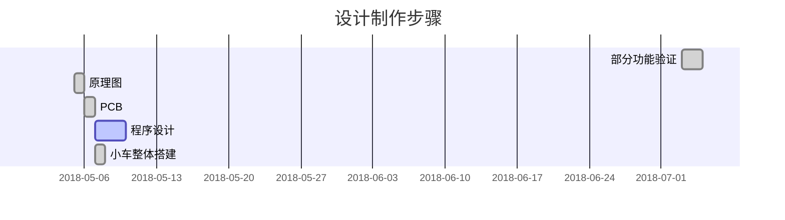

<kbd>**用到的工具有**：</kbd>
 - [x] openMV IDE
 - [x] Keil 5 编译器
 - [x] Altium Designer 


==实现的小功能有：==
==①设别颜色小球，并自动追寻小球==
==②简单测试与颜色小球的粗略距离，并且在小球10cm处停车==
==③按键调节PID参数以及调节识别的颜色==


# 总体设计
1.基础硬件DIY设计
2.openMV简单识别程序设计  与  单片机控制程序设计
3.效果展示


## 1.基础硬件DIY设计
**电路硬件：**
**[MCU]** STM32F103C8T6最小系统板
**[稳压电源]**【L7805】 7.2V稳压5.0V      【AMS1117-3.3】5.0V稳压3.3V 
**[外围电路]** 按键、蜂鸣器、OLED、干簧管

###  1）整体原理图


### 2）PCB电路


## 2.OpenMV简单识别程序设计  与  STM32控制程序设计
###  1）OpenMV简单识别程序设计【microPython】
\
==识别小球颜色并通过串口定时发送小球坐标与距离的数据包==
```python
#2018.8.2   【microPython】
import sensor, image, time , pyb
from pyb import UART
from pyb import Timer
from pyb import LED
import json

led = pyb.LED(3) # Red LED = 1, Green LED = 2, Blue LED = 3, IR LEDs = 4.
thresholds = [(27, 67, 19, 91, 45, 76), # 红色
              #(21, 75, 3, -38, 34, 68), # 绿色
              (27, 90, -3, -28, 31, 125),
              (0, 30, 0, 64, -128, 0)]  # generic_blue_thresholds
threshold_index = 1 # 0 for red, 1 for gre9en, 2 for blue


sensor.reset()
sensor.set_pixformat(sensor.RGB565)
sensor.set_framesize(sensor.QVGA)   #320*240
sensor.skip_frames(time = 100)
sensor.set_auto_gain(False) # must be turned off for color tracking
sensor.set_auto_whitebal(False) # must be turned off for color tracking
clock = time.clock()
uart = UART(3, 115200)
uart.init(115200, bits=8, parity=None, stop=1, timeout_char=1000) # 使用给定参数初始化

def tick(timer):            # we will receive the timer object when being called
    global data
    if blobs:
        print("Find")
        print('you send:',output_str)
        uart.write(data)


tim = Timer(4, freq=10)      # create a timer object using timer 4 - trigger at 1Hz
tim.callback(tick)          # set the callback to our tick function


def find_max(blobs):
    max_size=0
    for blob in blobs:
        if blob[2]*blob[3] > max_size:
            max_blob=blob
            max_size = blob[2]*blob[3]
    return max_blob

def Uart_Receive():   #UART接收 改变框小球的颜色阈值
    global threshold_index
    if uart.any():
        temp_data = uart.readchar()
        if temp_data==0:   #红色
           threshold_index=0

           print(temp_data,threshold_index)
        elif temp_data==1:
           threshold_index=1
           print(temp_data,threshold_index)


while(True):
    clock.tick()
    img = sensor.snapshot()
    Uart_Receive()
    blobs = img.find_blobs([thresholds[threshold_index]])
    if blobs:

        max_blob = find_max(blobs)
        b = max_blob[0] #方框元组
        L = (max_blob[2]+max_blob[3])/2
        l=int(1000/L)
        #x_error = max_blob[5]-img.width()/2   #求横向偏差
        x_error = max_blob[5]-img.width()/2

        img.draw_rectangle(max_blob[0:4])        # 画矩形
        img.draw_cross(max_blob[5], max_blob[6]) # 画十字

        #发送 小球的(x,y,l,n)
        #x为横坐标，y为纵坐标，l为粗略的距离，n为小球颜色(0：红 1：绿)
        output_str="%d,%d,%d,%d" % (max_blob.cx(),max_blob.cy(),l,threshold_index) #10进制字符包
        checkout=0xAA+0x55+0x07+int(max_blob.cx()/2)+max_blob.cy()+l+threshold_index
        data = bytearray([0xAA,0x55,0x07,int(max_blob.cx()/2),max_blob.cy(),l,threshold_index,0x00,0x00,checkout])#转成16进制
        #uart.write(data)
        time.sleep(1)
        led.on()
    else:
        print("NO FIND")
        data = bytearray([0xAA,0x55,0x07,0x00,0x00,0x00,0x00,0x00,0x00,0x06])
        uart.write(data)
        led.off()
```


<table>
    <tr>
        <td ><center>图3  抓取到绿色小球 </center></td>
        <td ><center>图4  抓取到红色小球</center></td>
</table>

###  2）STM32控制程序设计 【C语言】

##### ①对OpenMV发送的数据包进行解析
```c
void USART1_IRQHandler(void)                	//串口1中断服务程序
{
	uint8 i=0,j=0;
	if(USART_GetITStatus(USART1, USART_IT_RXNE) != RESET)  
	{//接收中断
		control_data[data_number]=USART_ReceiveData(USART1);
			data_number++; 
				if(data_number<(MAX_DATA_LENS+4))                   
				 {  //定义数据长度未包括包头和包长3个字节,+4
					if(control_data[0]==0xaa)//数据包包头字节
					{
						if(data_number>3)
						{
							if(control_data[1]==0x55)
							{	
								if(data_number>=(control_data[2]+3))  
								{//接收完数据包（第三个字节为数据长度，数据长度不包含开头和校验字）
							  	 for(i=0;i<=(data_number-2);i++) 
								 {
									j +=control_data[i];
								 }
								if(j==control_data[data_number-1]) //判断校验是否成功
							   	 {
									j=0;
								   recv1_data_ok=1;   //接收到正确完整数据包标志位置              
								 }
								 else
								{
									recv1_data_ok=0;
								}
								j=0;
								data_number=0;													
							}
						}
					else
					{
						recv1_data_ok=0;
						data_number=0;
					}
				}
			}
			else
			{ 
				recv1_data_ok=0;
				data_number=0;
			}
		}
		else
		{
			recv1_data_ok=0;
			data_number=0;
		}
			
    } 

} 
```
##### ②小车的简单PID控制
```c
#include "my_include.h"

extern CAR_STATUS_e car_mode;
extern moty_duty run_duty;
extern u8 control_data[MAX_DATA_LENS];
extern float C_P; //cameraP
extern float C_D; //cameraD
extern int16 ser_duty;
extern int16 x_error;
extern int16 last_x_error; 
extern uint8 ball_colcor;
extern uint8 BEEP_ON_OFF;

extern uint8 out_edge;//出界

void Car_mode_control()//小车简单控制逻辑单元
{

		if(control_data[3]<50 && control_data[3]!=0) //左出界
		{
			out_edge=Left;
		}
		else if(control_data[3]>110 && control_data[3]!=0) //右出界
		{
			out_edge=Right;
		}

		
		//--------------------车位状态判断-----------------//
		if(out_edge==Left && control_data[4]==0 && control_data[5]==0)
		{
			car_mode=finding_L;
		}
		else if(out_edge==Right && control_data[4]==0 && control_data[5]==0)
		{
			car_mode=finding_R;
		}
		else if (control_data[3]>0 && control_data[4]>0 && control_data[5]>0)
		{
			car_mode=run;
		}
		if(control_data[5]<=12 && control_data[5]>=3)
		{
				LED1=0;
				car_mode=stop;
		}
		else {LED1=1;}
		
		if(Boma4==0)//强制菜单
		{
			car_mode=stop;
		}
		//寻找小球的 色号（0为红，1为绿）	

		if(Boma3==0)
		{
			BEEP_ON_OFF=OFF;
		}
		else {BEEP_ON_OFF=ON;}
}


void PWM_updata()//速度控制中心
{

		if(car_mode == run)
		{
				TIM_SetCompare1(TIM1,run_duty.Speed_Duty_R);	//右为  TIM1  CH1
				TIM_SetCompare4(TIM1,run_duty.Speed_Duty_L);  //左为  TIM1  CH4
		}
		else if(car_mode == finding_R)
		{
				TIM_SetCompare1(TIM1,1400);	//右为  TIM1  CH1
				TIM_SetCompare4(TIM1,1400); //左为  TIM1  CH4
		}
		else if(car_mode == finding_L)
		{
				TIM_SetCompare1(TIM1,1500);	//右为  TIM1  CH1
				TIM_SetCompare4(TIM1,1500); //左为  TIM1  CH4
		}
	  else if(car_mode == stop)
		{
				TIM_SetCompare1(TIM1,0);	//右为  TIM1  CH1
				TIM_SetCompare4(TIM1,0);  //左为  TIM1  CH4
		}
}


void PD_control()
{
	last_x_error=x_error;
	x_error=control_data[3]-80;
	ser_duty = C_P*x_error-C_D*(last_x_error-x_error);

	run_duty.Speed_Duty_R=1550-ser_duty;//正为正转
	run_duty.Speed_Duty_L=1350-ser_duty;
	//左边FTM波//限幅	
	run_duty.Speed_Duty_L=run_duty.Speed_Duty_L<1300?1300:run_duty.Speed_Duty_L;
	run_duty.Speed_Duty_L=run_duty.Speed_Duty_L>1600?1600:run_duty.Speed_Duty_L;
	//右边FTM波//限幅	
   run_duty.Speed_Duty_R=run_duty.Speed_Duty_L<1300?1300:run_duty.Speed_Duty_R;
	run_duty.Speed_Duty_R=run_duty.Speed_Duty_L>1600?1600:run_duty.Speed_Duty_R;

}
```

##### ③系统状态设定
```c
typedef struct D  //速度结构体
{
	int16 Speed_Duty_L;
	int16 Speed_Duty_R;
}moty_duty;


typedef enum   //枚举小车简单状态
{
	finding_R=4,
	finding_L=3,
	run=2,
	stop=1,
	error=0,
}
CAR_STATUS_e;  //车子状态 

typedef enum
{
	mode_ON_OFF=0,
	car_run=1,
	flash=2,   
	picture=3,

}
MENU_LIST_e; //OLED菜单

```


## 3.效果展示        
        DESIGN


###  1）整体效果图
<kbd>**OLED页面设计**</kbd>
OELD可通过拨码开关切换页面

  ==①在OLED上显示小球的实时坐标【x,y】以及距离 l
      ② 显示小球在摄像头中的坐标并在屏幕上用“x”表示出来==
      
<kbd>**调试界面**</kbd>
预留五个调试按键

  ==①可调节PD参数
   ②切换追踪小球颜色阈值==


<table>
    <tr>
        <td ><center>图1  小车整体效果图 </center></td>
        <td ><center>图2 小车整体效果图</center></td>
</table>


